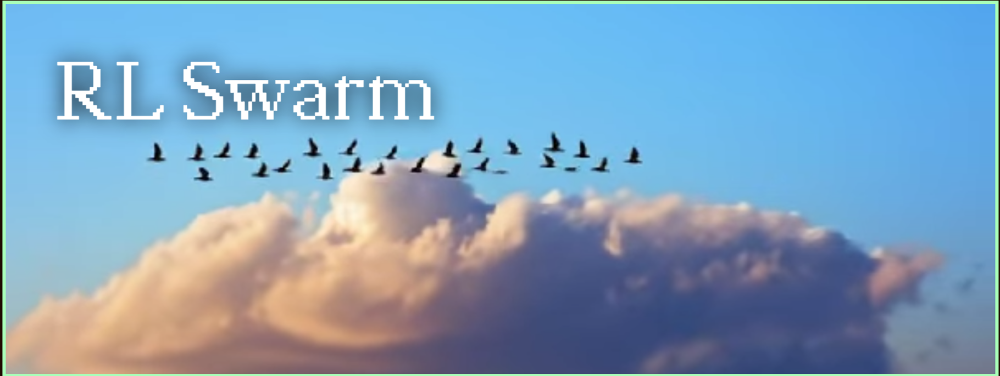
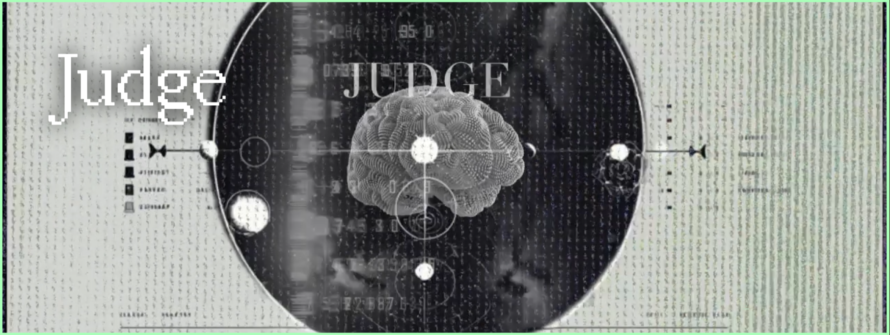

# gensyn

  

---
## gensyn
> Gensyn is a decentralized computing network for AI and machine learning.
It lets anyone with computing power — from personal computers to data centers — help train AI models and get paid for it.

### Official recources
Website: [gensyn.ai](https://www.gensyn.ai/) 
𝕏: [gensynai](https://x.com/gensynai) 
Discord: [gensyn](https://discord.com/invite/gensyn) 
Github: [github](https://github.com/gensyn-ai) 
Blog: [blog](https://blog.gensyn.ai/)

### Additional official recources
Dashboard: [dashboard](https://dashboard.gensyn.ai/) 
Docs: [documentation](https://docs.gensyn.ai/) 
Research page: [research](https://www.gensyn.ai/research) 
Testnet: [testnet](https://www.gensyn.ai/testnet) 
Block explorer: [gensyn alchemy](https://gensyn-testnet.explorer.alchemy.com/)

### My content
<b>Roles guide:</b>
- Hugging Face: [guide](https://github.com/kaize1337/gensyn/blob/main/roles/HuggingFace.md)
- The Swarm: [guide](https://github.com/kaize1337/gensyn/blob/main/roles/TheSwarm.md)
- The Block: [guide](https://github.com/kaize1337/gensyn/blob/main/roles/TheBlock.md)

<b>Links</b>
-  Team and Individuals associated with gensyn: [team members](https://github.com/kaize1337/gensyn/blob/main/content/TEAM.md)

### Apps
#### BlockAssist

> BlockAssist is an app from Gensyn that lets you train an AI assistant by observing your actions in Minecraft. It is part of their testnet and represents an unusual example of an AI training approach called assistance learning.
- Article: [article](https://www.gensyn.ai/articles/blockassist)
- Installation and Launch guide: [launch guide](https://docs.gensyn.ai/testnet/blockassist/getting-started)
- Launch with Cursor: [cursor guide](https://docs.gensyn.ai/testnet/blockassist/running-blockassist/running-blockassist-with-cursor)
- Repository: [repository](https://github.com/gensyn-ai/blockassist)

#### RL Swarn

> RL Swarm is an open-source, peer-to-peer framework for collaborative reinforcement learning (RL) over the internet. It enables multiple AI models to train together, exchanging feedback and improving collectively.
- Article: [article](https://www.gensyn.ai/articles/rl-swarm)
- Technical report: [tech report](https://arxiv.org/abs/2509.08721)
- Node Installation Guide: [node guide](https://github.com/Mayankgg01/Gensyn-ai-Rl-Swarm_Guide)
- Octa Node Launch Guide:[octa guide](https://docs.octa.space/gensyn)
- Repository: [repository](https://github.com/gensyn-ai/rl-swarm)

#### Judge

> Judge is an open-source, decentralized AI evaluation system developed by Gensyn. It provides cryptographically verifiable assessments of AI model outputs, ensuring transparency and reproducibility.
- Article «Introducing Judge»: [article](https://blog.gensyn.ai/introducing-judge/)
- Article «Judge: The End of Black-Box AI Evaluation»: [article](https://medium.com/@senpai.esteban16/judge-the-end-of-black-box-ai-evaluation-e92ae5e60aed)
- Repository: [repository](https://github.com/0xmoei/gensyn-ai?utm_source=chatgpt.com)
