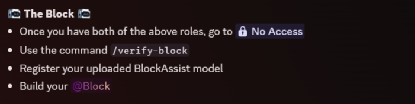

# The Swarm
> This is second role you can get after setup Telegram bot: for those who are going to launch a node

  

## How to get?
- Read and Follow step-by-step guide: https://gswarm.dev/docs
- Enter the command '/link-telegram'

  

- Get 'The Swarm' role
